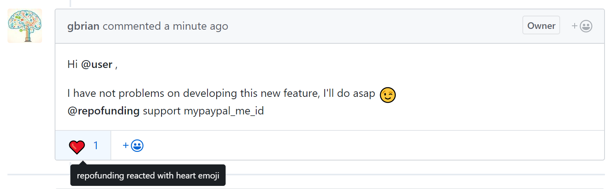
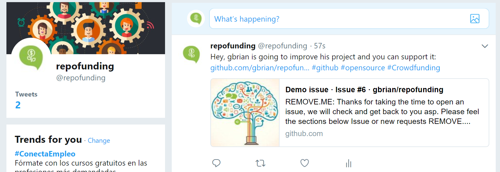

# Welcome to repofunding
*The crowdfunding platform for your open source repositories*

Enable crowdfunding to support your open source projects and get help from the community.

:smile: **Join repofunding community now:** 

:love_letter: **Stay tuned with latest anouncements:** 

### Crowdfunding an open source proyect
Maintaining an open source project has a cost. 
It requires a lot of dedication and coding hours that you do because your passion. 
:heart_eyes: It is amazing when you start receiving attention from other developers, the community or companies usinig your project. 
Then they find bugs or start suggesting new cool features that enjoy developing.

With repofunding you can ask the community for the support needed to keep your projects updated and continue improving them.

# How I can request crowdfunding for an issue
You can ask repofunding to support your issue by posting `@repofunding support donate_id` on your comments.

:warning: Anyone can reference @repofunding on an issue but only the repository owner can enable it!

:raising_hand: Currently @repofunding only works with **Paypal.ME**. The donation buttons will be generated using the `donate_id` pass to @repofunding. 

Example:    will point to **https://www.paypal.me/donate_id/1**  

# Example
Now you can estimate the cost of any issue and request crowdfunding for it so you don't have to bear with all the cost.
It is so easy and anyone can collaborate with 1, 5, 10, ... and get it done :clap:

**YOU:**

**REPOFUNDING**:

# Reputation
:point_up: The only one way to get funders: **reputation**. Be honest, deliver on time and build a reputation that will encourage the community to support you and your projects.

### Voting
Repository managers and funders are scored by the community throught the surveys. React with :+1: :-1:

# Social media
Your support requests will be published on social media to notify funders

 

